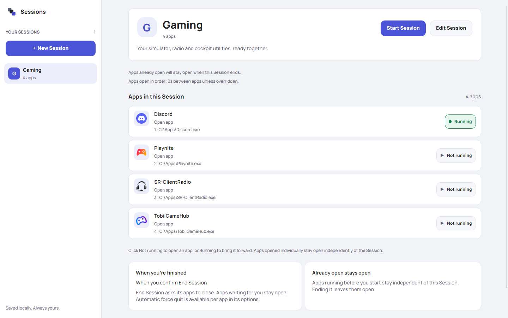
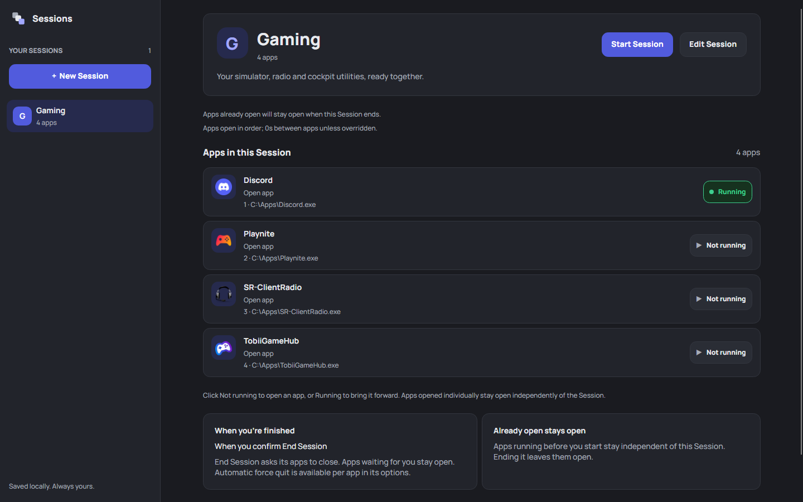
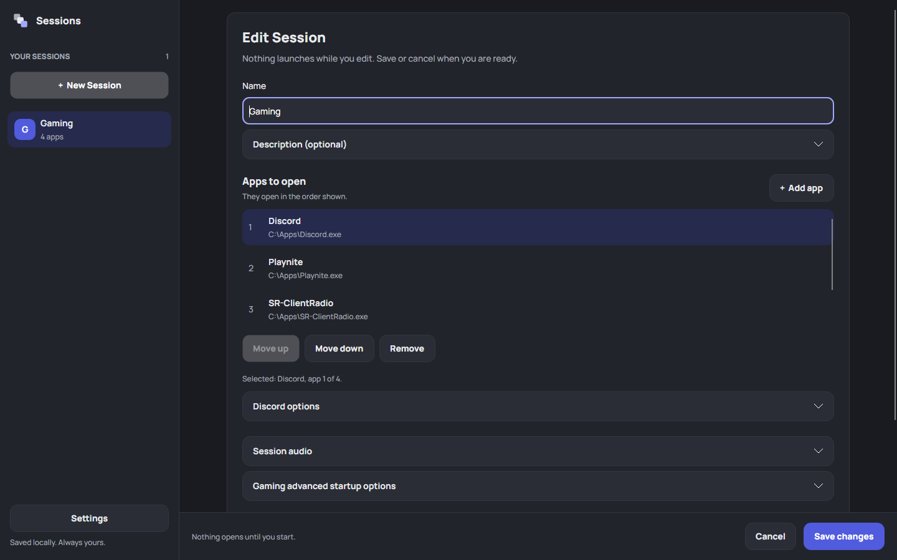
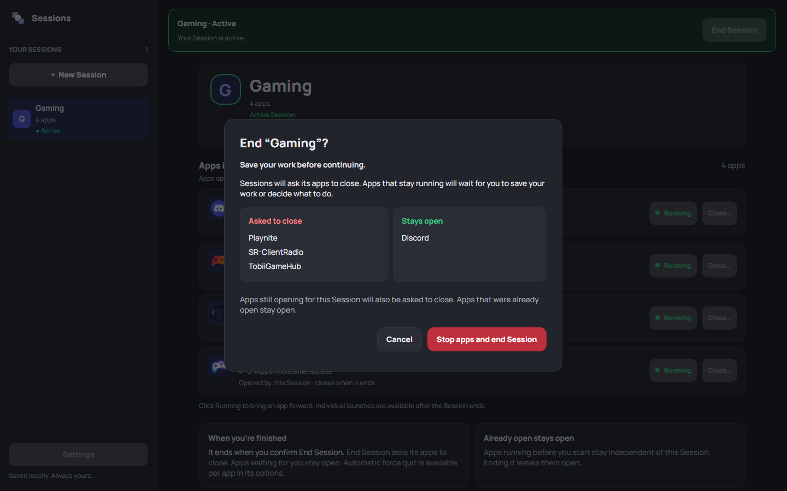

<p align="center">
  
</p>

<h1 align="center">Sessions</h1>

<p align="center">
  <strong>Get your apps together.<br>Get on with your day.</strong>
</p>

<p align="center">
  Save the apps you use together. Start them as a Session.<br>
  When you're finished, close the apps it opened and keep your other apps running.
</p>

<p align="center">
  Windows desktop · Local-first · Open source<br>
  No account. No cloud sync. Your setup stays on your computer.
</p>

<p align="center">
  <a href="#downloads"><strong>Download for Windows</strong></a> ·
  <a href="#see-it-in-action">Screenshots</a> ·
  <a href="#how-it-works">How it works</a> ·
  <a href="#build-from-source">Build from source</a>
</p>

## See it in action

<picture>
  <source media="(prefers-color-scheme: dark)" srcset="docs/images/session-dark.png">
  <source media="(prefers-color-scheme: light)" srcset="docs/images/session-light.png">
  
</picture>

<p align="center"><em>Your apps, their order, and what's running—all in one place.</em></p>

**Sessions 0.6 adds optional apps, Duplicate Session and an About page, reopens where you left off, and now installs with a branded setup.**
[Download the Windows alpha](#downloads) to try it with your own apps.

| Make it yours | Start together | End with clarity |
| --- | --- | --- |
| Give each activity its own apps, order and launch settings. | Open apps in order or all at once, with readiness waits when you need them. | Review what will close. Apps that were already running stay open. |

<details>
<summary><strong>See the light and dark themes side by side</strong></summary>

| Light | Dark |
| --- | --- |
|  |  |

Sessions follows your system appearance by default. Settings also offers Light and Dark overrides.

</details>

## A setup for whatever you're doing

| Session | Apps you might bring together |
| --- | --- |
| Work | Your browser, chat app, and notes |
| Flight sim | Your simulator, radio client, and cockpit utilities |
| Streaming | OBS, chat, and the app you're sharing |
| Development | Your editor, terminal, and browser |

Work, fly, stream, build. Each activity can have its own collection of apps. You
can end a Session manually, or choose an app whose exit prompts you to end it.
A main app is optional.

## How it works

1. **Create a Session.** Give it a name you'll recognise in the sidebar.
2. **Add your apps.** Search or scroll through Start menu apps, choose from running apps, or browse for an executable. Select several at once.
3. **Make it yours.** Arrange the opening order, choose when the Session ends, and optionally select sound output and microphone devices. Arguments, working folders, administrator launch and optional-app settings are available when needed.
4. **Start the Session.** Apps open using your chosen startup mode (in order by default). Matching apps that are already running stay open without becoming part of its cleanup.
5. **End when you're ready.** Review which apps will stop, save your work, and confirm.

Selecting a Session only shows its details; starting it is a separate action. Creating or editing one never launches its apps.



**Set the pace.** Advanced startup lets you open apps in order or together, add
pauses, wait for a process or window, and optionally bring Sessions or a chosen
app forward when startup finishes. Empty Sessions stay editable until you're ready
to add apps and start.

**Bring your audio setup.** Expand **Session audio** in the editor to choose your
headphones, speakers or microphone independently, or leave either unchanged.
Sessions applies Windows ordinary and communication defaults before opening apps
and restores previous defaults when you end the run—even if some apps stay open.
Later device changes are kept; missing devices and failed restoration show recovery
guidance. Apps with their own explicit audio selection may keep it. This changes
Windows defaults, so other apps following those defaults are affected too.

**Let optional apps be optional.** Turn on **Continue if this app doesn't start** for
utilities you can do without. If one can't open or doesn't finish starting, the Session
carries on and tells you why; anything it opened still closes when you end.

**Choose your appearance.** Open **Settings** from the sidebar or empty-library
header. Preview System / Light / Dark, interface sizes from 100–150% and separate
text sizes from 100–125%, then apply. Interface enlargement fits the available
window space; Settings keeps its reset controls reachable. Reset preferences
restores the defaults while keeping your saved Sessions.

### Small details that make daily use easier

- **Find apps by name.** Start menu discovery keeps supported shortcuts' arguments, working folders, and administrator settings.
- **Recognize your apps.** App cards show executable icons, with a name initial when an icon is unavailable.
- **See what's running.** A green Running button brings an app's window forward. Outside an active Session, click Not running to open an individual app.
- **Keep your place.** Search and switch between app sources without losing checked selections. Sessions reopens with its last window size and position and the Session you were viewing.
- **Start from a copy.** Duplicate Session opens a new draft with the same apps and settings.
- **Stay oriented.** An active Session remains visible while you browse your other saved setups.
- **Make it comfortable.** Settings offers System / Light / Dark, interface and separate text sizing, a preview, and reset. Preferences stay local; drafts and active runs are preserved.
- **Keep your edits.** Closing with a changed Session draft offers Keep editing, Discard and Save. Failed saves retain your edits. Deleting a Session requires confirmation and does not uninstall its apps.
- **Know what you're running.** Settings → About Sessions shows the version, your data folder and the licenses and notices included with the app.

## What happens when a Session ends?

Sessions remembers which processes it started for that run. An app that was already open stays yours to close.

For example, if your chat app is already running when you start a Streaming Session, ending that Session leaves chat open and stops the apps Sessions opened for it.

End Session requests a normal close and preserves apps that stay open, including apps waiting for you to save. Bring an app forward, finish and leave apps open, or explicitly confirm force quit for one app. You can opt an app into automatic force quit in its options; this may lose unsaved changes. Existing libraries default to normal close.



If an app cannot be stopped or safely tracked, Sessions explains the problem and offers recovery where available. Closing Sessions during an active run lets you end the run or leave its apps open. Apps opened individually remain independent of a later Session's cleanup.

[Browse the full screenshot gallery](docs/SCREENSHOTS.md). Images show the actual
0.6.0 UI with real executable icons, isolated sample data and simulated process status.

## Downloads

**Sessions is in Alpha.** The core Session workflow is available for everyday testing.
Features and saved-data formats may change, and some apps require manual handling.
Feedback and bug reports are welcome.

Download the Sessions 0.6.1
[Windows x64 MSI](https://github.com/datstma/sessions/releases/download/v0.6.1/Sessions-0.6.1-win-x64.msi)
from [GitHub Releases](https://github.com/datstma/sessions/releases/tag/v0.6.1).
The installer includes .NET and installs for your Windows user, with a Start menu
shortcut and an option to launch Sessions when setup finishes. Installer and
application binaries are unsigned.

[What's new in 0.6.1](docs/release-notes/0.6.1.md): a branded installer with Launch
Sessions. [What's new in 0.6.0](docs/release-notes/0.6.0.md): optional apps, Duplicate
Session, window and selection memory, About with in-app licenses, library upgrade
backups and a roomier layout.

Close Sessions before installing, updating, or uninstalling. Updates and uninstall
preserve your saved Sessions and appearance preferences. To update, download and run a newer MSI; there is no
automatic updater. The release page includes checksums, source, and validation limits.

**Library compatibility:** saving in 0.6.0 or later uses v6, which 0.5.0 and earlier cannot
open. Loading an older library alone does not rewrite it. On the first save, Sessions
keeps the previous file beside your library as `sessions.v<old version>-backup-<date>-<time>.json`
and shows where it is; restore it as `sessions.json` to return to an older release.

See [Building and releasing Sessions](docs/RELEASING.md) for versioning and packaging.

### Current boundaries

- Windows desktop apps are the supported target. macOS and Linux are not implemented.
- One Session can run at a time.
- Start menu discovery supports desktop shortcuts; it is not a complete catalogue of Microsoft Store apps. Packaged-app activation is not supported.
- General launcher handoffs, background services, and entire process trees are not automatically managed. Some apps may need manual handling.
- Running apps without an accessible window can show their status but cannot be brought forward by the Running control.
- Sessions opens apps with saved launch settings; it does not capture your current windows, documents, browser tabs, or desktop layout.
- Window closing protects changed drafts. Editor Cancel explicitly discards edits; crash recovery and autosave are not included.
- Audio choices change Windows defaults, not per-app routing or volume. Restoration requires a normal Session end or close; a crash or forced termination cannot restore devices.

## Build from source

**Plugins:** since 0.5.0, Sessions bundles plugin support, starting with Steam. Open
Settings → Plugins, then use Add app → Plugins to select installed Steam games.
Steam apps show running status and offer opt-in closing in each app’s options;
already-running apps and the shared Steam client stay open during Session cleanup.
Use **Close…** beside a running app to close it individually after confirmation,
including apps opened outside Sessions. [Plugin guide and limits](docs/PLUGINS.md).
Third-party plugin loading, Hue and Home Assistant remain future work.

Use Windows with **.NET SDK 10.0.401**, pinned in [global.json](global.json).
Rider is optional; the command line is enough.

Clone the repository and run these commands:

```powershell
git clone https://github.com/datstma/sessions.git
cd sessions
dotnet build Sessions.slnx
dotnet run --project src/Sessions.App/Sessions.App.csproj
```

If you downloaded the source instead, open a terminal in the extracted repository and run the two `dotnet` commands.

In Rider, open `Sessions.slnx` and run `Sessions.App`.

The main app runs without administrator privileges. Windows may ask for approval when you explicitly launch an app as administrator or when cleanup needs permission to stop an elevated app.

### Run the tests

```powershell
dotnet test tests/Sessions.Core.Tests/Sessions.Core.Tests.csproj
dotnet test tests/Sessions.App.Tests/Sessions.App.Tests.csproj
```

Core tests cover execution, ownership, ordering, persistence, and failure handling. App tests cover interaction and rendered UI. Native Windows checks are opt-in; see the [verification instructions](docs/DEVELOPMENT_NOTES.md#previous-stopping-point--end-of-day-2026-09-08) for enabling them.

### Where your Sessions live

Your saved library is readable JSON at:

```text
%LOCALAPPDATA%\Sessions\sessions.json
```

It stores Session definitions and launch settings. Live process ownership is kept only for the current run. Built-in import/export and cloud synchronisation are not implemented. Settings → About Sessions → **Open data folder** opens this location.

## Project direction

The immediate focus is reliable app startup and cleanup, clear feedback, and a UI that makes the next step obvious. Upcoming usability work includes accessibility and display-scaling checks, and better guidance for invalid fields.

Broader ideas—such as audio-device changes, power settings, and additional action types—are future possibilities, not features in the current app or promised release dates.

- [Product definition](docs/PRODUCT.md): intent, behaviour, and scope.
- [Architecture](docs/ARCHITECTURE.md): how the app is structured and why.
- [Backlog](docs/BACKLOG.md): completed work, open issues, and evidence.
- [Development notes](docs/DEVELOPMENT_NOTES.md): decisions, findings, and the latest handoff.

## Help shape Sessions

Useful feedback starts with the activity you're trying to set up. [Open an issue](https://github.com/datstma/sessions/issues) with the app involved, reproduction steps, expected behaviour, actual behaviour, and any message Sessions displays. Mention whether the app was already running or was started by the Session—this matters for cleanup.

Before proposing a substantial change, read the product scope and architecture. Keep execution logic in Core, Windows integration in App services, and UI behaviour in the presentation layer. [AGENTS.md](AGENTS.md) records the repository's development and validation conventions.

## License

Copyright (c) 2026 datstma and contributors.

Sessions is licensed under the **GNU General Public License, version 3 only** (`GPL-3.0-only`). See [LICENSE](LICENSE) for the full terms.

You may use, modify, and redistribute Sessions, including commercially, under those terms. If you distribute modified versions, they must remain GPLv3-licensed and recipients must have access to the corresponding source code. Sessions is provided without warranty; see the license for details.

Third-party dependencies and assets retain their own licenses.
